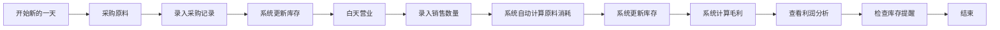
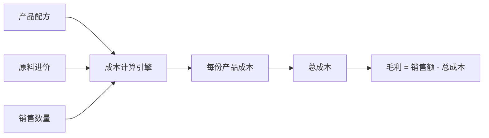

## 1. 产品概述

早餐店采购与成本核算管理工具，专为小型早餐店店主设计，帮助店主轻松管理每日原料采购、自动核算产品成本、分析销售利润，并提供智能库存提醒和周经营报告。

- **核心价值**：简化采购记账流程，自动计算成本与利润，让店主一目了然掌握经营状况
- **目标用户**：小型早餐店店主、个体户经营者
- **解决痛点**：手工记账繁琐、成本计算复杂、利润不清晰、库存管理混乱

## 2. 核心功能

### 2.1 用户角色

| 角色 | 注册方式 | 核心权限 |
|------|----------|----------|
| 店主 | 无需注册，本地使用 | 完整功能权限，包括数据录入、查看报表、修改配置 |

### 2.2 功能模块

1. **首页仪表盘**：今日概览、库存提醒、快捷操作入口
2. **采购管理**：每日原料采购记录、采购历史查询
3. **销售管理**：每日销售记录、自动计算原料消耗
4. **产品管理**：产品配方配置、售价设置
5. **原料管理**：原料信息、进价设置、库存管理
6. **利润分析**：每日毛利计算、产品利润排行
7. **周报统计**：周经营报告、销售趋势分析
8. **库存提醒**：低库存预警、补货提醒

### 2.3 页面详情

| 页面名称 | 模块名称 | 功能描述 |
|----------|----------|----------|
| 首页仪表盘 | 今日概览 | 显示今日采购金额、销售金额、预估毛利、库存提醒 |
| 首页仪表盘 | 快捷操作 | 一键进入采购录入、销售录入 |
| 采购管理 | 采购录入 | 选择原料、输入数量和单价，自动计算金额 |
| 采购管理 | 采购历史 | 按日期查看采购记录，支持修改和删除 |
| 销售管理 | 销售录入 | 输入各产品销售数量，自动计算原料消耗 |
| 销售管理 | 销售明细 | 查看每日销售详情和原料消耗清单 |
| 产品管理 | 产品列表 | 管理6种产品（包子、油条、豆浆、稀饭、茶叶蛋、煎饼）的配方和售价 |
| 产品管理 | 配方编辑 | 设置每个产品所需的原料用量（如：1个包子用多少面粉、多少肉馅） |
| 原料管理 | 原料列表 | 管理6种原料（面粉、油、黄豆、鸡蛋、葱花、肉馅）的进价和库存 |
| 原料管理 | 进价调整 | 修改原料进价，支持历史进价记录 |
| 利润分析 | 每日利润 | 显示每日销售收入、原料成本、毛利、毛利率 |
| 利润分析 | 产品排行 | 按利润排序显示各产品的盈利情况 |
| 周报统计 | 周报告 | 显示本周每天的销售额、利润，标注最好和最差的一天 |
| 周报统计 | 趋势图表 | 展示本周销售和利润趋势图 |
| 库存提醒 | 预警列表 | 显示库存低于安全线的原料，弹出提醒 |

## 3. 核心流程

### 3.1 每日经营流程

店主每天早上采购原料 → 录入采购记录（系统自动更新库存）→ 白天营业 → 晚上录入各产品销售数量 → 系统自动计算原料消耗、更新库存、计算毛利 → 查看今日利润和产品排行 → 检查库存提醒 → 结束一天。

### 3.2 成本计算流程

录入产品配方 → 设置原料进价 → 录入销售数量 → 系统计算：每份产品成本 = Σ(原料用量 × 原料进价) → 总成本 = Σ(销售数量 × 每份成本) → 毛利 = 销售收入 - 总成本。

## 4. 用户界面设计

### 4.1 设计风格

- **设计方向**：温暖亲切的早餐店风格，采用暖色调为主，给人温馨、舒适的感觉
- **主色调**：暖橙色 (#FF8C42) - 代表早餐、温暖、活力
- **辅助色**：米黄色 (#FFF5E6) - 背景色，温暖柔和；深棕色 (#5D4037) - 文字色，稳重可靠
- **强调色**：绿色 (#4CAF50) - 利润、正常；红色 (#F44336) - 预警、亏损
- **按钮风格**：圆角矩形，轻微阴影，悬停有上浮效果
- **字体**：标题使用 "Noto Serif SC" 衬线字体，温暖有质感；正文使用 "Noto Sans SC" 无衬线字体，清晰易读
- **布局风格**：卡片式布局，顶部导航，侧边栏菜单，内容区域模块化
- **图标风格**：使用温暖食物相关的 emoji 图标（🥟、🥖、🥛、🍚、🥚、🥞）

### 4.2 页面设计概述

| 页面名称 | 模块名称 | UI 元素 |
|----------|----------|----------|
| 首页仪表盘 | 今日概览 | 4个数据卡片（采购额、销售额、毛利、毛利率），大数字显示，趋势箭头 |
| 首页仪表盘 | 库存提醒 | 预警卡片，红色背景，闪烁动画，显示"该买面粉了"等提示 |
| 首页仪表盘 | 快捷操作 | 2个大按钮（录入采购、录入销售），圆角设计，图标+文字 |
| 采购管理 | 采购录入 | 表单布局，原料下拉选择，数量和单价输入框，实时计算金额 |
| 销售管理 | 销售录入 | 6个产品卡片，每个卡片有产品图标、名称、售价、数量输入框 |
| 利润分析 | 每日利润 | 数据卡片展示，产品排行使用条形图，利润最高的产品高亮显示 |
| 周报统计 | 周报告 | 表格展示每日数据，最好/最差日期用颜色标注，趋势折线图 |
| 原料管理 | 进价调整 | 原料卡片，显示当前进价，点击弹出修改对话框，记录历史进价 |

### 4.3 响应式设计

- **设计优先**：桌面端优先（店主主要在电脑上使用）
- **移动端适配**：使用 Tailwind 响应式类，在平板和手机上自动调整布局
- **触控优化**：按钮最小高度 44px，输入框足够大，方便触控操作

### 4.4 动效设计

- **页面加载**：数据卡片依次淡入，有轻微的上浮动画
- **库存提醒**：低库存卡片有呼吸灯效果，引起注意
- **按钮交互**：悬停时轻微放大 + 阴影加深，点击时有按压效果
- **数据更新**：数字变化时有平滑过渡动画
- **表单提交**：成功时显示绿色勾选动画，失败时红色抖动提示
