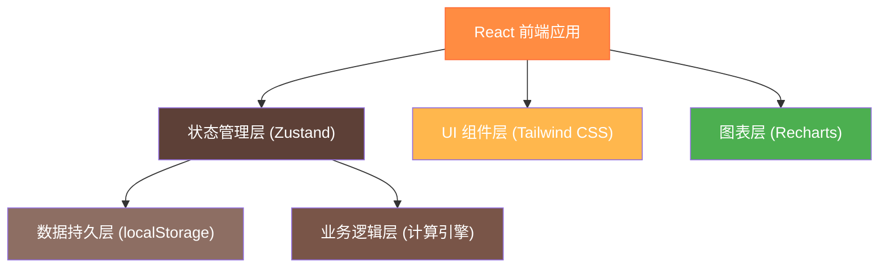
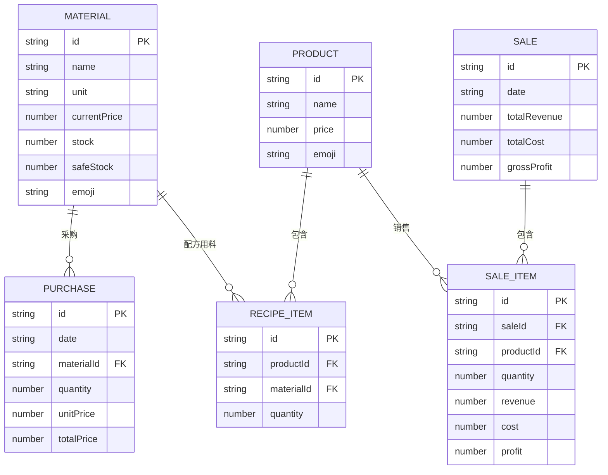

## 1. 架构设计

本项目为单页面应用（SPA），采用前端纯本地存储方案，无需后端服务器，数据保存在浏览器 localStorage 中，适合单用户使用场景。



## 2. 技术描述

### 2.1 技术栈选型

- **前端框架**：React 18 + TypeScript - 类型安全，组件化开发，生态成熟
- **构建工具**：Vite 5 - 开发体验好，构建速度快
- **样式方案**：Tailwind CSS 3 - 原子化 CSS，快速开发，响应式支持
- **状态管理**：Zustand - 轻量级状态管理，API 简洁，支持持久化
- **图表库**：Recharts - React 生态图表库，支持折线图、柱状图等
- **路由**：React Router 6 - 单页面路由管理
- **图标**：Lucide React - 现代化图标库，轻量易用
- **数据存储**：localStorage - 本地持久化，无需后端

### 2.2 项目初始化

使用 Vite 官方模板初始化 React + TypeScript 项目：
```bash
npm create vite@latest breakfast-shop -- --template react-ts
```

## 3. 路由定义

| 路由路径 | 页面名称 | 功能描述 |
|----------|----------|----------|
| `/` | 首页仪表盘 | 今日概览、库存提醒、快捷操作 |
| `/purchase` | 采购管理 | 采购录入、采购历史 |
| `/sales` | 销售管理 | 销售录入、销售明细 |
| `/products` | 产品管理 | 产品列表、配方编辑 |
| `/materials` | 原料管理 | 原料列表、进价调整 |
| `/profit` | 利润分析 | 每日利润、产品排行 |
| `/weekly` | 周报统计 | 周报告、趋势图表 |

## 4. 数据模型

### 4.1 实体关系图



### 4.2 数据结构定义

#### 原料 (Material)
```typescript
interface Material {
  id: string;
  name: string;           // 名称：面粉、油、黄豆、鸡蛋、葱花、肉馅
  unit: string;           // 单位：斤、升、个
  currentPrice: number;   // 当前进价
  stock: number;          // 当前库存
  safeStock: number;      // 安全库存（低于此值提醒）
  emoji: string;          // 图标
  priceHistory: {
    date: string;
    price: number;
  }[];
}
```

#### 产品 (Product)
```typescript
interface Product {
  id: string;
  name: string;           // 名称：包子、油条、豆浆、稀饭、茶叶蛋、煎饼
  price: number;          // 售价
  emoji: string;          // 图标
  recipe: RecipeItem[];   // 配方
}

interface RecipeItem {
  materialId: string;
  quantity: number;       // 每份产品的原料用量
}
```

#### 采购记录 (Purchase)
```typescript
interface Purchase {
  id: string;
  date: string;           // 采购日期 YYYY-MM-DD
  materialId: string;
  quantity: number;
  unitPrice: number;
  totalPrice: number;
  createdAt: string;
}
```

#### 销售记录 (Sale)
```typescript
interface Sale {
  id: string;
  date: string;           // 销售日期 YYYY-MM-DD
  items: SaleItem[];
  totalRevenue: number;
  totalCost: number;
  grossProfit: number;
  createdAt: string;
}

interface SaleItem {
  productId: string;
  quantity: number;
  revenue: number;
  cost: number;
  profit: number;
  materialConsumption: {
    materialId: string;
    quantity: number;
  }[];
}
```

### 4.3 初始数据

系统初始化时预设以下数据：

#### 预设原料
| 原料 | 单位 | 初始进价 | 初始库存 | 安全库存 | 图标 |
|------|------|----------|----------|----------|------|
| 面粉 | 斤 | 3.5 | 20 | 5 | 🌾 |
| 油 | 斤 | 12 | 5 | 2 | 🫒 |
| 黄豆 | 斤 | 5 | 10 | 3 | 🫘 |
| 鸡蛋 | 个 | 0.8 | 50 | 20 | 🥚 |
| 葱花 | 斤 | 6 | 3 | 1 | 🧅 |
| 肉馅 | 斤 | 25 | 8 | 2 | 🥩 |

#### 预设产品
| 产品 | 售价 | 图标 | 配方示例 |
|------|------|------|----------|
| 包子 | 2.5 | 🥟 | 面粉0.1斤 + 肉馅0.05斤 + 葱花0.02斤 |
| 油条 | 2.0 | 🥖 | 面粉0.08斤 + 油0.02斤 |
| 豆浆 | 2.0 | 🥛 | 黄豆0.05斤 |
| 稀饭 | 1.5 | 🍚 | 面粉0.02斤 |
| 茶叶蛋 | 1.5 | 🥚 | 鸡蛋1个 |
| 煎饼 | 4.0 | 🥞 | 面粉0.12斤 + 油0.01斤 + 葱花0.01斤 |

### 4.4 核心计算逻辑

#### 成本计算
```
每份产品成本 = Σ(原料用量 × 原料当前进价)
销售该产品成本 = 销售数量 × 每份产品成本
```

#### 原料消耗计算
```
某原料消耗量 = Σ(产品销售数量 × 该产品中该原料用量)
```

#### 利润计算
```
销售收入 = 销售数量 × 产品售价
销售成本 = 销售数量 × 每份产品成本
产品利润 = 销售收入 - 销售成本
总毛利 = Σ所有产品利润
毛利率 = (总毛利 / 总销售收入) × 100%
```

#### 库存更新
- 采购时：库存 += 采购数量
- 销售时：库存 -= 原料消耗量
- 进价更新时：更新 `currentPrice` 并记录到 `priceHistory`

## 5. 项目目录结构

```
breakfast-shop/
├── src/
│   ├── store/              # 状态管理
│   │   ├── useStore.ts     # Zustand store
│   │   └── types.ts        # TypeScript 类型定义
│   ├── components/         # 组件
│   │   ├── Layout/         # 布局组件
│   │   ├── Dashboard/      # 仪表盘组件
│   │   ├── Purchase/       # 采购管理组件
│   │   ├── Sales/          # 销售管理组件
│   │   ├── Products/       # 产品管理组件
│   │   ├── Materials/      # 原料管理组件
│   │   ├── Profit/         # 利润分析组件
│   │   ├── Weekly/         # 周报组件
│   │   └── common/         # 公共组件
│   ├── pages/              # 页面组件
│   ├── utils/              # 工具函数
│   │   ├── calculator.ts   # 计算引擎
│   │   ├── date.ts         # 日期处理
│   │   └── storage.ts      # 本地存储
│   ├── data/               # 初始数据
│   │   └── seed.ts         # 种子数据
│   ├── App.tsx
│   ├── main.tsx
│   └── index.css
├── package.json
├── vite.config.ts
├── tailwind.config.js
└── tsconfig.json
```
